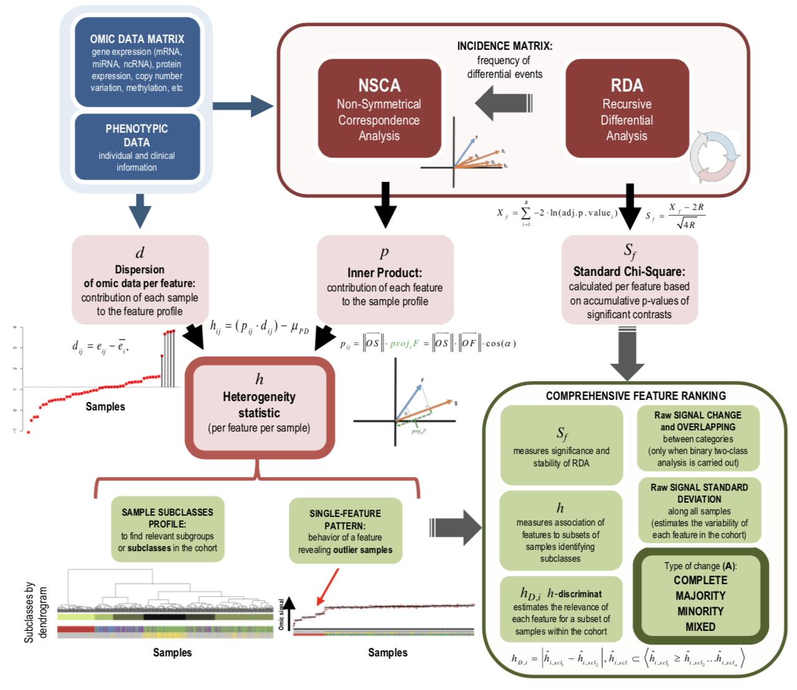
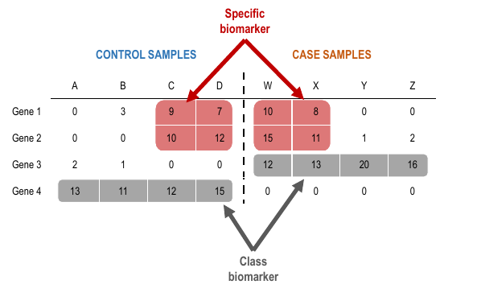
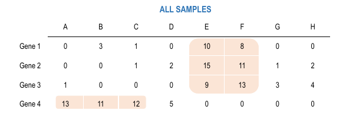
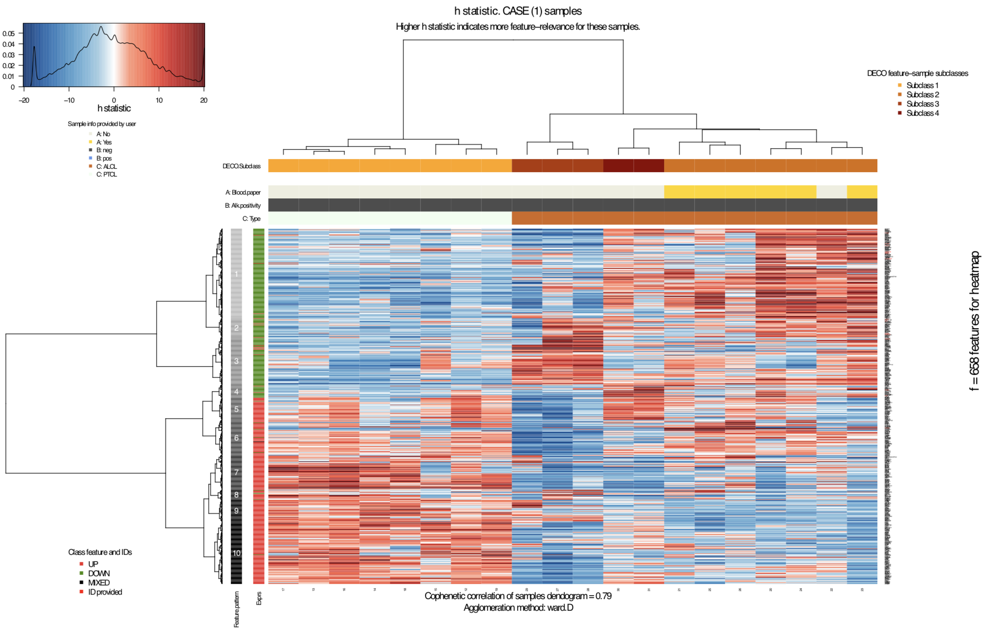
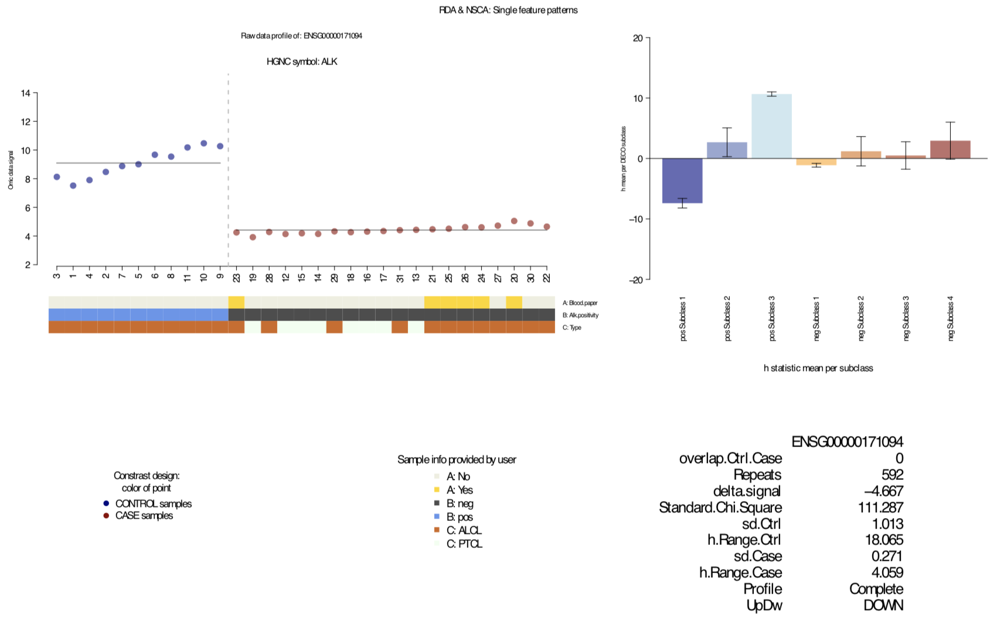

<!--
%\VignetteEngine{knitr::rmarkdown}
%\VignetteIndexEntry{deco}
\usepackage[utf8]{inputenc}
-->

```{r pre,echo=FALSE,results='hide',warning=TRUE,include=FALSE}
library(knitr)
opts_chunk$set(warning=TRUE, message = FALSE, cache = FALSE, fig.path = "figures/", tidy = FALSE, tidy.opts = list(width.cutoff = 60))
```

---


# Variability and heterogeneity in high-dimensional data

Individual diversity and variability is one of the most complex issues to deal within high-dimensional studies of large populations, as the ones currently performed in biomedical analyses using omic technologies. DECO is a method that combines two main computational procedures: **(i)** a **Recurrent-sampling Differential Analysis (RDA)** that performs combinatorial sampling without replacement to select multiple sample subsets followed by a differential analysis (LIMMA); and **(ii)** a **Non-Symmetrical Correspondence Analysis (NSCA)** on differential events, which would improve the characterization and assigment of features and samples in a common multidimensional space. This second step combines in a single statistic (h-statistic) both the feature-sample changes detected and the predictor-response information provided by NSCA. 

The statistical procedure followed in both parts of the method are detailed in the original [publication](#references) [1], but this brief **vignette** explains how to use **DECO** to analyze multidimensional datasets that may include heterogeneous samples. The aim is to improve characterization and stratification of complex sample series, mostly focusing on large patient cohorts, where the existence of outlier or mislabeled samples is quite possible.

Thus, **DECO** can reveal exclusive associations between features and samples based in specific differential signal and provide a better way for the stratifycation of populations using multidimensional large-scale data. The method could be applied to data derived from different **omic technologies** since LIMMA has been demonstrated to be applicable to non-transcriptomic data. Along the vignette, we used genome-wide expression data obtained with microarrays or with RNA-seq (either for genes, miRNAs, ncRNAs, etc).



# Installation

The **deco** R source package can be downloaded from our **[lab website](http://bioinfow.dep.usal.es/deco/)**, directly from **[Bioconductor repository](https://bioconductor.org/)** or **[GitHub repository](https://github.com/fjcamlab/deco)**. This R package contains a experimental dataset as example, two pre-run R objects and all functions needed to run a DECO analysis.

```{r, message = FALSE, eval = FALSE}
## From Bioconductor repository
if (!requireNamespace("BiocManager", quietly = TRUE)) {
      install.packages("BiocManager")
  }
BiocManager::install("deco")

## Or from GitHub repository using devtools
BiocManager::install("devtools")
devtools::install_github("fjcamlab/deco")
```

# Experimental data

At present, the method directly supports two types of data from transcriptomic technologies: microarrays and RNA-seq platforms. In case of microarrays, robust normalization of raw signal is needed for correct application of *eBayes* method (done for example with the **RMA** method or with  **normalizeBetweenArrays** method from [LIMMA package](#references) [2]). Notwithstanding, RNA-seq read counts matrix (genes or transcripts as rows and samples as columns) can be the input; and in this case then user should apply [voom normalization method](#references) [2]. Below, we show two different examples of both types of datasets obtained with such platforms.

## Microarrays dataset: study on lymphoma subtypes

Here, a normalized microarray gene expression matrix from clinical samples is used as example taken from [Scarfo et al.](#references)[3]. **Anaplastic Large Cell Lymphoma** (**ALCL**) is an heterogeneous disease with two well differentiated forms based on ALK gene expression: *ALK(-)* and *ALK(+)*. The dataset, obtained in [GSE65823](http://www.ncbi.nlm.nih.gov/geo/query/acc.cgi?acc=GSE65823) from [GEO database](http://www.ncbi.nlm.nih.gov/geo/), corresponds to genome-wide expression profiles of human T-cell samples hybridizated on *Affymetrix* HGU133Plus2.0 platform, which were mapped to ENSEMBL genes with *genemapperhgu133plus2cdf* CDF package from [GATExplorer](#references) [4]. The mapping from *Affymetrix* probes to genes can be also done using [BrainArray](http://brainarray.mbni.med.umich.edu/Brainarray/Database/CustomCDF/CDF_download.asp) CDF packages.

The main interest to include this dataset, to be analysed with DECO, is because using this sample set [Scarfo et al.](#references) [3] identified of **a subset of patients within the ALK(-) class** discovering high ectopic expression of several gene markers. To do so, the authors applied one of the most used methods for detection of outliers and heterogeneous behavior, called [COPA](#references) [5]. Further comparisons between **COPA** and other related methods can be found in our [paper about DECO](#references) [1]. The phenotypic information about this sample set provided by GEO database were included in an *SummarizedExperiment* object. This R object called `ALCLdata` could be directly loaded as follows:

```{r, message = FALSE}
## Loading the R package
library(deco)

# Loading ALCL dataset and example R objects
data(ALCLdata)

# to see the SummarizedExperiment object
ALCL

# to see the phenotypic information
head(colData(ALCL))
```

Classes vector to run a *supervised* analysis (explained in following section) to compare both ALCL classes *positive*ALK and *negative*ALK, or to compare three classes also considering PTCL samples.

```{r, message = FALSE, results='hide'}
## Group-vs-group comparison
classes.ALCL <- colData(ALCL)[, "Alk.positivity"]
names(classes.ALCL) <- colnames(ALCL)
## Multiclass comparison
multiclasses.ALCL <- factor(apply(
    as.data.frame(colData(ALCL)[, c("Alk.positivity", "Type")]), 1,
    function(x) paste(x, collapse = ".")
))
```

## RNA-seq dataset: study on breast cancer subtypes

Here, we show a RNAseq dataset analysed using DECO, downloaded from [The Cancer Genome Atlas (TCGA)](http://cancergenome.nih.gov/). It is composed by 1212 clinical samples from patients with different [subtypes of Breast Cancer](#references) [6], which includes standard histological subtypes (given by markers ESR1, PGR and HER2) and two classes associated to the cell-type, called: **Invasive Ductal Carcinoma** (IDC) and **Invasive Lobular Carcinoma** (ILC). The genes of the dataset are mapped to HGNC symbol IDs and the dataset can be loaded directly in R or downlad from the [TCGA data portal](https://portal.gdc.cancer.gov/):

```{r, message = FALSE}
# Loading library
library(curatedTCGAData)
library(MultiAssayExperiment)

# Download counts from RNAseq data
BRCA_dataset_counts <- curatedTCGAData(
    diseaseCode = "BRCA",
    assays = "RNASeqGene", dry.run = FALSE
)

# or download normalized RNAseq data
BRCA_dataset_norm <- curatedTCGAData(
    diseaseCode = "BRCA",
    assays = "RNASeq2GeneNorm", dry.run = FALSE
)

# Extract the matrix
BRCA_counts <- assay(BRCA_dataset_counts)
BRCA_norm <- assay(BRCA_dataset_norm)

dim(BRCA_counts)
dim(BRCA_norm)

# Apply log-scale and normalization if needed...
BRCA_exp <- limma::voom(BRCA_counts)$E # logCPMs
BRCA_exp <- log2(BRCA_norm + 1) #logRPKMs

```

Then, user can run *voom* normalization method provided in LIMMA R package to calculates matrix of **logCPMs**. Further information about **voom** normalization and its properties can be found in [LIMMA](#references) R package [2]. The normalized matrix is then analysed using the RDA method of DECO. **DECO** is also able to analyse other RNAseq data types (RPKMs, FPKMs or TPMs values). These data are usually log-scaled. 

## Use of other *omic* platforms

Together with RNA-seq or microarray platforms, DECO algorithm can be applied to datasets obtained with other **omic platforms** (as far as a correct normalization of the data per sample can be achieved). In order to provide an example of other platform, we show an example of a **miRNAs dataset** from same TCGA library used above:

```{r, message = FALSE}
# Download counts from RNAseq data of miRNAs
BRCA_dataset_counts_mirna <- curatedTCGAData(
    diseaseCode = "BRCA",
    assays = "miRNASeqGene", dry.run = FALSE
)

# Extract the matrix
BRCA_counts_mirna <- assay(BRCA_dataset_counts_mirna)

dim(BRCA_counts_mirna)

# Apply log-scale and normalization if needed...
BRCA_exp_mirna <- limma::voom(BRCA_counts_mirna)$E # logCPMs
```

Additionally, more information about different omic platforms and sample information is available on `curatedTCGA` or `MultiAssayExperiment` R package vignettes. Despite the sample information, we could design group-vs-group (binary), multiclass or unsupervised comparisons in TCGA datasets using `deco` and `curatedTCGA` R packages.

# Intern parallelization with `BiocParallel`

The computational cost of DECO algorithm is depending on the size of our omic matrix: number of features, number of samples, number of categories, etc. For this reason, the `deco` R package includes intern parallelization based on [BiocParallel R package](http://bioconductor.org/packages/release/bioc/html/BiocParallel.html):

- `SnowParam()` for computing in distributed memory

- `MulticoreParam()` for computing in shared memory

- `BatchJobsParam()` for computing with cluster schedulers

- `DoparParam()` for computing with foreach

- `SerialParam()` for non-parallel evaluation

Before running the main functions `decoRDA()` or `decoNSCA()` R functions, the user can set up the number of cpus following the procedures described in the `BiocParallel` vignette:

```{r, message = FALSE}
library(BiocParallel)

# Non-parallel computing
bpparam <- SerialParam()

# Computing in shared memory
bpparam <- MulticoreParam()
```

# RDA, Recurrent-sampling Differential Analysis: *Standard.Chi.Square*

We proposed a exhaustive subsampling strategy which selects subsets of samples (from the different classes) and compares all against all (in an exhaustive search). When the number of combinations is very large a random selection of all possible subsets is done. In order to obtain the best possible results, three parameters should be taken into consideration before running the analysis: **(i)** the subsampling size called `r` (DECO method calculates an optimal size of subsampling subsets if the user does not define it); **(ii)** number of subsets or combinations, called `iterations`, to compare in this subsampling step; and **(iii)** a p-value threshold for the differential tests or contrasts, called `q.val` and computed using eBayes from [LIMMA](#references) [2].

Aiming to summarize all positive differential events (DE) for each feature (combinations with a lower *p-value* than threshold), Fisher's combined probability test is applied to each final feature vector of *p-values* to obtain a **Standard.Chi.Square**, which will is not affected by type of analysis (*supervised* or *unsupervised*) because it only takes into account number of positive DE events.

## Supervised analysis

Depending on *classes* input vector, a *supervised* or *binary* analysis compares just two types of samples (i.e. healthy donors *versus* patients in a typical biomedical study). The `decoRDA()` RDA function will adjust the optimal subsampling size *r* (that the user can modify) to explore all DE signal, and UP and DOWN events will be taken into account for posterior **NSCA**. Here, an example of *decoRDA* function using `ALCLdata` dataset:

```{r, message = FALSE, results='hide'}
## if gene annotation was required (annot = TRUE or rm.xy = TRUE)
library(Homo.sapiens)
```

```{r, message = FALSE, results='hide'}
## number of samples per category
table(classes.ALCL)
# classes.ALCL
#   neg   pos
#    20    11

## example of SUPERVISED or BINARY design with Affymetrix microarrays data
# set annot = TRUE if annotation is required and corresponding library was loaded
sub_binary <- decoRDA(
    data = assay(ALCL), classes = classes.ALCL, q.val = 0.01,
    iterations = 1000, rm.xy = FALSE, r = NULL, 
    control = "pos", annot = FALSE, bpparam = bpparam,
    id.type = "ENSEMBL", pack.db = "Homo.sapiens"
)
```

This **RDA** procedure generates an `incidenceMatrix` which counts differential events per gene (feature) per sample. Thus, this matrix would contain just differential genes as rows and samples as columns with one differential event at least.

```{r, message = FALSE}
dim(sub_binary$incidenceMatrix)
```

The `incidenceMatrix` produced after the RDA, can reveal the important changes that mark an entire subclass (grey boxes in **Figure 1**), as well as specific signal changes that mark a subclass of samples (red boxes in **Figure 1**). As we can see in a simple example (**Figure 1**), both *Gene 1* and *Gene 2* seem to mark two subclasses (or subtypes) inside each compared class, while *Gene 3* and *Gene 4* reflect the behaviour of control and case classes respectively. Following the RDA step, the NSCA step analyses the numbers of the `incidenceMatrix`. The NSCA analysis is also done splitting UP and DOWN changes when the algorithm is run in *supervised* mode.




## Unsupervised analysis

If *classes* input vector is empty, a *unsupervised* analysis is run comparing all against all samples taking different subsets (each combination of samples is unique) and looking for UP events. Then, those samples which show any differential change with statistical significance will be counted. In order to clarify final results of NSCA analysis, it is important to underline that just UP regulated events will be assigned to samples, while both UP and DOWN regulation events are counted in the *supervised* analyisis explain above.

```{r, message = FALSE, results='hide'}
# if gene annotation will be required (annot = TRUE or rm.xy = TRUE)
# library(Homo.sapiens)
# example of UNSUPERVISED design with RNA-seq data (log2[RPKM])
sub_uns <- decoRDA(
    data = assay(ALCL), q.val = 0.05, r = NULL,
    iterations = 1000, annot = FALSE, rm.xy = FALSE,
    bpparam = bpparam, id.type = "ENSEMBL", 
    pack.db = "Homo.sapiens"
)
```

In this case, the **RDA** procedure will generate an `incidenceMatrix` which counts just UP events per gene per sample.



## Multiclass analysis 

Together with *supervised* or *unsupervised* analyses, the method can be run for *multiclass comparison*, taking subsets of samples from several classes identified *a priori* and forcing them to be compared. Then, we would count differential events per feature per sample but there will not be mix between different classes. Here, we show an example of a breast cancer dataset (from [Ciriello et al.](#references) [6], log2(RPKM+1) scaled) that uses the well-defined PAM50 classes:

```{r, message = FALSE, results='hide'}
# number of samples per category
table(multiclasses.ALCL)
# multiclasses.ALCL
# neg.ALCL neg.PTCL pos.ALCL
#       12        8       11

# example of MULTICLASS design with RNA-seq data (log2[RPKM])
sub_multiclass <- decoRDA(
    data = assay(ALCL), classes = multiclasses.ALCL, q.val = 0.05,
    r = NULL, iterations = 1000, annot = FALSE, 
    bpparam = bpparam, rm.xy = FALSE,
    id.type = "ENSEMBL", pack.db = "Homo.sapiens"
)
```

## Running the RDA function: `decoRDA()`

This vignette presented some examples of `decoRDA()` subsampling function for *supervised*, *multiclass* and *unsupervised* analyses. Now, the details about all the input parameters which control the RDA procedure are indicated:

- `data` input corresponds to our expression matrix with features as rows and samples as columns.

- `q.val` is the threshold imposed to the *adjusted.p.value* from *LIMMA* method in each iteration.

- `r` is the resampling size.

- `temp.path` defines a location in your computer where `decoRDA()` would save temporary results.

- `classes` is a character vector or factor indicating to which class each sample belongs.

- `control` is a character indicating which label has to be set as control class in a *supervised* analysis.

- `rm.xy` is a logical indicating if genes/proteins/features placed on *X* or *Y* chromosomes should be removed before run RDA (it requires `id.type` and `annot` inputs). We recommended to set `TRUE` if genre unbalance is present in the dataset.

- `annot` logical indicating if feature annotation is required.

- `id.type` is a character describing the type of id corresponding to the rownames of `data` input. These types can be found:`

```{r, message = FALSE}
# load the annotation package
library(Homo.sapiens) # for human

AnnotationDbi::columns(Homo.sapiens)
```

- `pack.db` is a character corresponding to the annotation library (by default `Homo.sapiens`).

# NSCA, Non-Symmetrical Correspondence Analysis: *h-statistic*

Once the frequency matrix of DE events or *incidenceMatrix* has been produced, DECO follows applying a [NSCA](#references) [7] procedure. **NSCA** allows analyse all dependencies and covariances between differential features and samples placing them in the same relational space. Further information can be found in a more detailed vignette included in the DECO R package and also in our original [publication](#references) [1].

As a measure of this significant association, NSCA function returns a *inner product* matrix relating feature-sample dependencies in the differential context. After the *inner product* matrix is generated, samples with similar profiles (using all the genes that gave DE events over a threshold: `pos.rep`) are grouped together using a hierarchical clustering based on Pearson correlation distances between samples: $dist_{ij} = 1 - corr(p_i,p_j)$. 

Additionally, all different *agglomeration methods* to creates a dendrogram (see further information in `hclust` R function) are assessed looking for the method that shows highest [*cophenetic correlation*](#references) [8]. Thus, we identify the best clustering procedure to make subclasses, choosing an optimal number of subclasses depending on the best *Hubber's Pearson* $\gamma$ cutting this dendrogram.

## Running the NSCA function: `decoNSCA()`

Here, we show an example (based on group-vs-group comparison using `ALCLdata`) of how user can run the second step of **DECO**:

```{r, message = FALSE, results='hide'}
# It can be applied to any subsampling design (BINARY, MULTICLASS, or UNSUPERVISED)
deco_results <- decoNSCA(
    sub = sub_binary, v = 80, method = "ward.D", bpparam = bpparam,
    k.control = 3, k.case = 3, samp.perc = 0.05, rep.thr = 1
)

deco_results_multiclass <- decoNSCA(
    sub = sub_multiclass, v = 80, method = "ward.D", bpparam = bpparam,
    k.control = 3, k.case = 3, samp.perc = 0.05, rep.thr = 1
)

deco_results_uns <- decoNSCA(
    sub = sub_uns, v = 80, method = "ward.D", bpparam = bpparam,
    k.control = 3, k.case = 3, samp.perc = 0.05, rep.thr = 1
)
```

Several important **input parameters** of this `decoNSCA()` function can be set up by user. Further information could be found in `?decoNSCA` help page. Finally, this function will return an output R object `deco` that is described in the following section.

# Description of final output results

```{r, message = FALSE}
slotNames(deco_results)
```

After running NSCA function *decoNSCA*, the method produces an R object of *deco* class. The main slots with relevant information inside this object are:

- `featureTable` is the main output table with the **feature statistics** and rankings. We can extract it using `featureTable()` function on a *deco* R object.

- `NSCAcluster` contains the NSCA information and sample subclasses. It will be duplicated if a *supervised* analysis is run. We can extract it using `NSCAcluster()` function on a *deco* R object.

- `incidenceMatrix` is the **Absolute frequency matrix** with DE events per sample used in the NSCA.

- Vector of *classes* with labels per sample. For *unsupervised* analysis it will be **NA**.

- Label set as *control*.

- `q.val` is the adjusted.p.val threshold previously defined.

- `subsampling.call` and `nsca.call` correspond to both `decoRDA` and `decoNSCA` function calls.

## Feature ranking and statistics

The main output table with relevant feature information from RDA, NSCA and subclasses searching corresponds to *featureTable*. 

```{r, warning=TRUE}
resultsTable <- featureTable(deco_results)
dim(resultsTable)

# Statistics of top-10 features
resultsTable[1:10, ]
```

The most relevant statistic derived from [RDA](#5) technique is the *Standard.Chi.Square*. The amount of *differential events* or *Repeats* that each gene (each feature) appears differentially changed among classes or samples is also very important, and it is summarized in *Standard.Chi.Square* since this parameter weights the significance of the DE. Genes with similar *Repeats* values which correspond to lower *P.value* resemble higher *Standard.Chi.Square* values, meanwhile genes with higher *P.value*, or near *q.val* threshold imposed by user, give lower *Standard.Chi.Square* values.

 IDs | Standard.Chi.Square  | Repeats | P.values | h.Range | Dendrogram.group
------------- | ------------- | ------------ | ------------ | ------------ | ------------
DE feature 1  | 250  | 100 | ~ 0.01 | 3.26 | 2
DE feature 2  | 150  | 100 | ~ 0.05 | 12.65 | 5

Moreover, for *supervised* analysis the *exprsUpDw* character indicates if case class shows UP or DOWN regulation of each feature. In some cases, several genes could follow deregulation in both classes for some subgroup of samples, which we called change-type **MIXED**. This kind of change pattern could explain some hidden characteristic of the samples and allows finding outliers: a subgroup of samples that only change in a subset of genes. In this cases there are not differences between the mean or median for the whole classes, and so classical methods like **SAM** or **LIMMA** do not find these patterns.

After RDA and NSCA analysis, the statistics referred to sample subclasses found is used to rank DE features properly. In this way, $h$ statistic obtained per feature is used to determine how each feature discriminates each subclass found. As we mentioned above, this statistic combines both the DE changes and the predictor-response relationship between features and samples, so it refers to feature's discriminant ability. Furthermore, `Dendrogram.group` helps to identify to which pattern belongs each feature and each sample within the $h$ statistic heatmap (`decoReport()` PDF report).

## Sample subclasses membership

To see how samples are grouped into different *subclasses* within class:

```{r, warning=TRUE}
# If SUPERVISED analysis
sampleSubclass <- rbind(
    NSCAcluster(deco_results)$Control$samplesSubclass,
    NSCAcluster(deco_results)$Case$samplesSubclass
)
# If UNSUPERVISED analysis
sampleSubclass <- NSCAcluster(deco_results_uns)$All$samplesSubclass

## Sample subclass membership
head(sampleSubclass)
```

Additionally, we can print a brief summary of DECO analysis using `summary` or `show` native R functions.

```{r, warning=TRUE, results='hide'}
## Example of summary of a 'deco' R object (ALCL supervised/binary example)

summary(deco_results)
# Decomposing Heterogeneous Cohorts from Omic profiling: DECO
# Summary:
# Analysis design: Supervised
# Classes compared:
# neg pos
#  20  11
#            RDA.q.value Minimum.repeats Percentage.of.affected.samples NSCA.variability
# Thresholds        0.01          10.00                            5.00               86
# Number of features out of thresholds: 297
# Feature profile table:
# Complete Majority Minority    Mixed
#       12       87      197        1
# Number of samples affected: 31
# Number of positive RDA comparisons: 1999
# Number of total RDA comparisons: 10000
```

An **extended report** (as PDF file) including more detailed information of the analysis and several plots illustrating all the results (as the bi-clustering approach to `h` statistic matrix) can be also produced with the `decoReport()` R function. Information about the extended report is included in longer and more detailed vignette in the DECO R package.

# Output reports

## Generating a PDF report
DECO R package implements an additional function to help users to view and analyse the output results. It contains a detailed representation of main results (subclasses found, main biomarkers, $h$ statistic heatmap, best feature profiles, feature's overlapping signal...). Here, we briefly describe how to run `decoReport()` R function:

```{r, warning=TRUE, eval=FALSE}
### Example of decoReport using microarray dataset
decoReport(deco_results, sub_binary,
    pdf.file = "Report.pdf",
    info.sample = as.data.frame(colData(ALCL))[, c(
        "Type", "Blood.paper"
    ), drop = FALSE],
    cex.names = 0.3, print.annot = TRUE
)
```

A main result of DECO analysis is the *$h-statistic$ matrix (H)* derived from both combination of RDA and NSCA information, which is described in the [original publication](#references) [1]. The `decoReport()` function generates the **heatmap** representation of this *$h-statistic$ matrix* that includes a double correlation analysis between samples and between features and two derived clustering dendrograms.

```{r, warning=TRUE, results='hide', eval=FALSE}
# Extracting the h-statistic matrix used for
# the stratification and the feature profile's plot

# All samples if 'multiclass' or 'unsupervised' comparison
hMatrix <- NSCAcluster(deco_results_uns)$All$NSCA$h

# Control categories if 'binary' comparison
hMatrix <- NSCAcluster(deco_results)$Control$NSCA$h

# Case categories if 'binary' comparison
hMatrix <- NSCAcluster(deco_results)$Case$NSCA$h

dim(hMatrix)
```

The **heatmap** reveals subclasses of samples and feature patterns, using the **h-statistic** as basis for this biclustering approach. This heatmap could be visualized within the PDF report or using the specific function `plotHeatmapH()` to represent it in a separate PDF.

```{r, warning=TRUE, eval=FALSE}
## Opening a new PDF file
pdf("HeatmapH_example.pdf", width = 16, height = 12)

## Heatmap with h-statistic matrix and biclustering of features-samples.
plotHeatmapH(
  deco = deco_results, 
  info.sample = as.data.frame(colData(ALCL))[, c(9, 8, 10)], 
  cex.names = 0.3, print.annot = FALSE
)

## Closing the PDF file
dev.off()
```




## Associating phenotype with DECO subclasses

DECO is intended to provide sample subclasses, grouping by similar profiles of *h-statistic*. The `plotAssociationH()` function returns several simple plots, showing the association between a phenotype characteristic with every subclass found by DECO. 

```{r, warning=TRUE}
## Association plot between phenotype and DECO subclasses
plotAssociationH(
    deco = deco_results, 
    info.sample = multiclasses.ALCL
)
```

Specifically:

- Violin plot: distribution of average *h-statistic* values along samples (per feature) within the newly provided categories of samples (phenotype), grouping all features according to their corresponding DECO subclass. 

- Left-heatmap: frequency table of \emph{samples} among DECO subclasses and newly provided sample categories (phenotype).

- Right-heatmap: frequency table of \emph{features} among DECO subclasses and newly provided sample categories (phenotype).


## Generating plots and profiles for a specific feature

The `plotDECOProfile()` R function provides a way to visualize a single feature profile. Here, we show the examples for two genes discovered by [Scarfo et al.](#references) [3] in the analysis of the ALCL samples: **(i)** **ALK**, that is the key gene-marker used by doctors to separate the two major subtypes of **Anaplastic Large Cell Lymphomas** (in the analysis done with DECO, this gene shows a change-profile *Complete* which supports the value of the gene to separate the ALCL samples); **(ii)** **ERBB4**, that was reported by authors as biomarker of a new subclass found inside the *negative* ALCL samples (in the analysis done with DECO, this gene shows a change-profile *Minority* indicating the existence of a subset of *negative* ALCL samples that are separated from the rest). 

DECO uses the *$h-statistic$* values for ordering samples along every single feature profile, providing a lecture of how samples are grouped by this new statistic. This order will differ from raw omic values because it also weights the predictor/response relationship between sample/feature (given by NSCA), highlighting the most relevant substructures found in our omic dataset.

```{r, warning=TRUE, eval=FALSE}
## ALK and ERBB4 feature profiles
# ALK: ENSG00000171094
# ERBB4: ENSG00000178568
plotDECOProfile(
    deco = deco_results, id = c("ENSG00000171094", "ENSG00000178568"),
    data = assay(ALCL), pdf.file = "ALCL_profiles.pdf",
    cex.samples = 2, info.sample = as.data.frame(colData(ALCL))[, c(9, 8, 10)]
)
```

Figure 5 corresponds to ALK gene profile, including a plot of its raw expression along samples and a plot of the h statistic of this gene per subclass. This gene shows a change type COMPLETE. The h-statistics per subclass found are large for the controls ("positive" ALCLs), and constant and close to 0 for the "negative" ALCLs.



## Comparison of h-statistic and original omic data

As mentioned before, the *h-statistic* is intended to integrate both omic dispersion and response-predictor information among features and samples (given by NSCA). For this reason, there might be a gaining in sample stratification from original omic profile to *h-statistic* profile, given the same feature (see original publication).

Given a feature, the `plotGainingH()` function returns three simple plots correlating both omic profile and *h-statistic* profile to see if the discrimination of categories has been improved. Noteworthy, since **binary or supervised** comparisons between two classes generates two different NSCA analyses, *h-statistic* of DECO subclasses must be contextualized in the same original sample groups.

```{r, warning=TRUE}
## Feature to represent
id <- featureTable(deco_results)[1, "ID"]

#### Comparing DECO subclasses against source of samples.
plotGainingH(
  deco_results, data = assay(ALCL), ids = id, 
  print.annot = FALSE, orig.classes = FALSE
)
```

Thus, three plots are returned:

- Boxplot: distribution of omic data and h-statistic values per DECO subclass. 

- Top-left: parametric correlation between omic data and *h-statistic* per sample.

- Top-right: non-parametric correlation (ranking) between omic data and *h-statistic* per sample.


# References

1: Campos-Laborie FJ, Risueño A, Roson-Burgo B, Droste C, Fontanillo C, Ortiz-Estevez M, Trotter MW, Sánchez-Santos JM and De Las Rivas J (2019). **DECO: decompose heterogeneous population cohorts for patient stratification and discovery of sample biomarkers using omic data profiling.** *Bioinformatics*. Accepted.

2: Ritchie ME, Phipson B, Wu D, Hu Y, Law CW, Shi W and Smyth GK (2015). **limma powers differential expression analyses for RNA-sequencing and microarray studies.** *Nucleic Acids Res.*, 43:e47. \doi{doi:10.1093/nar/gkv007}.

3: Scarfo I, Pellegrino E, Mereu E, Kwee I, Agnelli L, Bergaggio E, Garaffo G, Vitale N, Caputo M, Machiorlatti R, Circosta P, Abate F, Barreca A, Novero D, Mathew S, Rinaldi A, Tiacci E, Serra S, Deaglio S, Neri A, Falini B, Rabadan R, Bertoni F, Inghirami G, Piva R; European T-Cell Lymphoma Study Group (2016). **Identification of a new subclass of ALK-negative ALCL expressing aberrant levels of ERBB4 transcripts.** *Blood*, 127:221-232. \doi{doi:10.1182/blood-2014-12-614503}.

4: Risueño A, Fontanillo C, Dinger ME, De Las Rivas J (2010). **GATExplorer: genomic and transcriptomic explorer; mapping expression probes to gene loci, transcripts, exons and ncRNAs.** *BMC Bioinformatics*, 11:221. \doi{doi:10.1186/1471-2105-11-221}.

5: MacDonald JW and Ghosh D (2006). **COPA--Cancer Outlier Profile Analysis.** *Bioinformatics*, 22:2950-2951. \doi{doi:10.1093/bioinformatics/btl433}.

6: Ciriello G, Gatza ML, Beck AH, Wilkerson MD, Rhie SK, Pastore A, Zhang H, McLellan M, Yau C, Kandoth C, Bowlby R, Shen H, Hayat S, Fieldhouse R, Lester SC, Tse GM, Factor RE, Collins LC, Allison KH, Chen YY, Jensen K, Johnson NB, Oesterreich S, Mills GB, Cherniack AD, Robertson G, Benz C, Sander C, Laird PW, Hoadley KA, King TA; TCGA Research Network., Perou CM (2015). **Comprehensive molecular portraits of invasive lobular breast cancer**. *Cell*, 163:505-519. \doi{doi:10.1016/j.cell.2015.09.033}.

7: Lauro N and D'Ambra L (1984). **L'analyse non symetrique des correspondances.** In: *Data Analysis and Informatics III*, (Diday E, Jambu M, Lebart L, Pages J and Tomassone R Eds.). North Holland, Amsterdam, p.433-446.

8: Sokal RR and Rohlf FJ (1962). **The comparison of dendrograms by objective methods.** *Taxon*, 11, 33.


